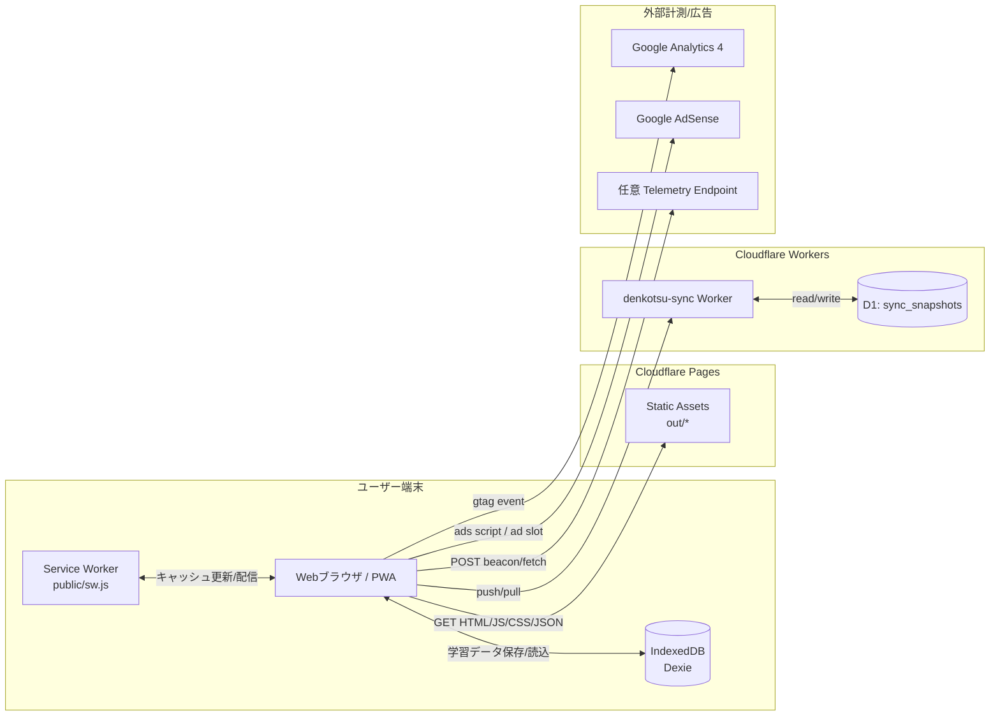
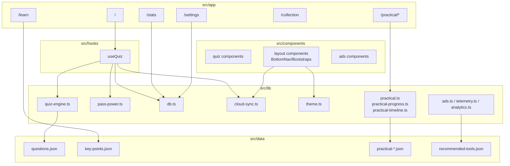
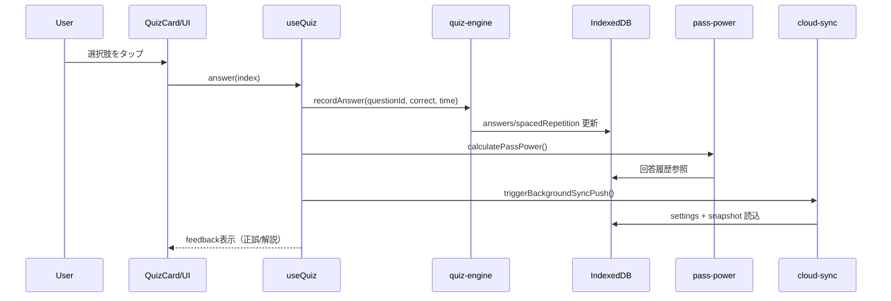
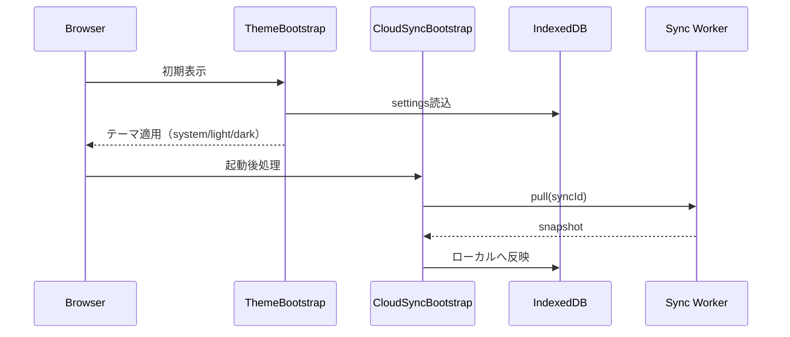
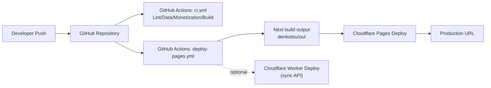

# デンコツ アーキテクチャ詳細仕様

最終更新日: 2026-02-26

## 1. 目的とスコープ

本書は、第二種電気工事士アプリ「デンコツ」の実装構造を、運用・拡張・障害切り分けに使える粒度で整理したアーキテクチャ仕様です。

対象範囲:

- フロントエンド本体（Next.js Static Export + PWA）
- ローカル学習データ（IndexedDB / Dexie）
- 同期基盤（Cloudflare Workers + D1）
- 計測/収益化基盤（GA4 / AdSense / telemetry）
- CI/CD（GitHub Actions + Cloudflare Pages）

## 2. システム全体構成

## 3. アプリ内部アーキテクチャ

## 4. データ責務

| レイヤ | 主なデータ | 責務 |
|---|---|---|
| `src/data/*.json` | 問題・要点・実技問題の静的コンテンツ | ビルド同梱データ（参照専用） |
| `src/lib/db.ts` (IndexedDB) | 回答履歴、忘却曲線状態、設定、図鑑、実績 | 学習状態の正本（端末内） |
| `cloudflare/sync-worker` + D1 | `sync_snapshots` | 端末間同期用のスナップショット保管 |
| GA4 / telemetry | 収益導線・広告イベント | 運用分析・改善指標 |

### 4.1 IndexedDB テーブル

- `answers`: 回答ログ（正誤、回答時刻、解答時間）
- `spacedRepetition`: SM-2系の復習パラメータ
- `settings`: 学習設定・テーマ・同期情報
- `collections`: 図鑑獲得アイテム
- `achievementUnlocks`: 実績解除ログ

## 5. 主要ランタイムフロー

### 5.1 クイズ回答フロー

### 5.2 次問題選定フロー（優先度制御）

`selectNextQuestion()` は次の順で候補を絞り込みます。

1. 期限超過の復習問題（`nextReviewAt`）
2. 未回答問題（モード設定に応じた重み付け）
3. 定着の弱い問題（間隔・正答履歴）
4. 直前問題の連続出題回避、直近カテゴリ偏り制限

調整パラメータは `settings` で管理:

- `quizMode`
- `repeatDelayQuestions`
- `maxSameCategoryInWindow`

### 5.3 起動時ブートストラップ

## 6. 技能試験（Phase 4）構成

`/practical` 配下は 3 機能で構成:

- `/practical/wiring`: 候補13問のステップ練習
- `/practical/defects`: 欠陥判定クイズ（合格/欠陥ありの2択）
- `/practical/timeline`: 40分の手動フェーズ管理

実技データは `src/data/practical-wiring-problems.json` と `src/data/practical-defect-questions.json` を参照します。

## 7. セキュリティ方針

- `layout.tsx` で CSP を構成し、必要な外部オリジンのみ許可
- AdSense/GA/Telemetry は環境変数が妥当な場合のみ有効化
- 同期コードは 12〜64 文字・英数字混在・弱い文字列拒否でバリデーション
- 同期 API は単純な CORS 制御 + スキーマ検証を実装

## 8. ビルド/デプロイアーキテクチャ

### 8.1 CI 品質ゲート

`ci.yml` で実行:

- `npm run lint`
- `npm run check:data:ci`
- `npm run check:monetization`
- `npm run build`

### 8.2 デプロイ条件

`deploy-pages.yml` は以下 Secrets が揃う場合にのみ本デプロイを実行します。

- `CLOUDFLARE_API_TOKEN`
- `CLOUDFLARE_ACCOUNT_ID`
- `CLOUDFLARE_PROJECT_NAME`

不足時は deploy ステップをスキップし、CI失敗にはしません。

## 9. 監視・運用で見るべき指標

- 学習: 回答数、正答率、カテゴリ別合格力
- 継続: 連続学習日数、週次進捗、目標達成率
- 収益導線: sponsored click / ad rendered / ad interaction
- 安定性: CI失敗率、ビルド時間、同期エラー率

## 10. 拡張ポイント（将来）

- 問題追加は `src/data/questions.json` 増強 + `check:data` 通過で反映
- 出題最適化は `quiz-engine.ts` のスコアリング関数を拡張
- 同期強化は Worker 側で認証レイヤ追加（現状は同期コード方式）
- 実技強化は `practical-*.json` に手順/欠陥パターン追加で横展開可能
