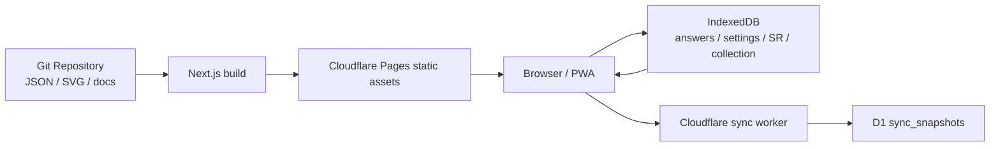
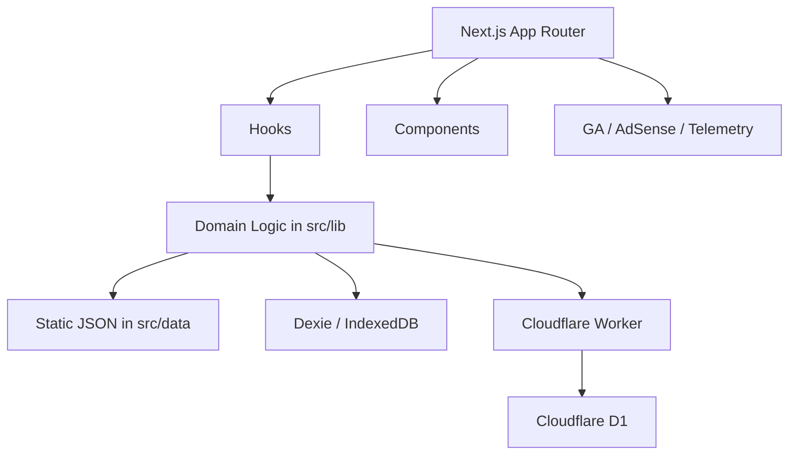
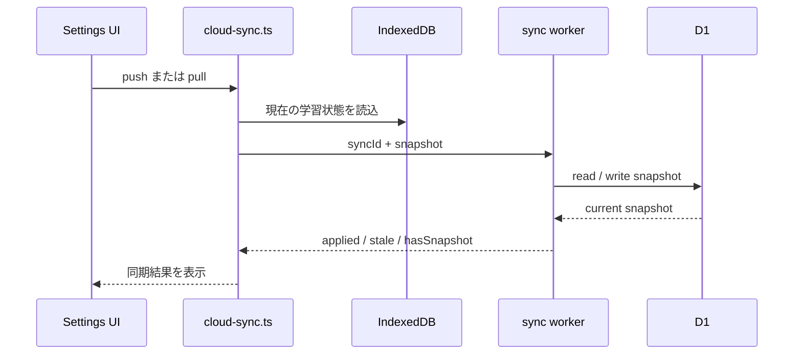

# デンコツ プロジェクト詳細監査ドキュメント

最終更新日: 2026-04-06

## 1. 本書の目的

本書は、第二種電気工事士学習アプリ「デンコツ」について、以下を横断的に把握するための監査ドキュメントです。

- このプロジェクトが何を解決するアプリなのか
- 何の機能を持ち、どこまで実装済みなのか
- 実装がどのような構造で組まれているのか
- データ、同期、計測、広告、実技対策がどのように接続しているのか
- 現時点のセキュリティ・プライバシー・品質保証レベルがどの程度か
- 運用上の注意点と、残る技術的負債が何か

本書は既存の仕様・計画・アーキテクチャ文書を補完する位置づけです。

- 全体仕様: [`docs/SPEC.md`](./SPEC.md)
- アーキテクチャ図: [`docs/architecture.md`](./architecture.md)
- フェーズ計画: [`docs/phase1-mvp.md`](./phase1-mvp.md), [`docs/phase2-engagement.md`](./phase2-engagement.md), [`docs/phase3-monetize.md`](./phase3-monetize.md), [`docs/phase4-practical.md`](./phase4-practical.md)

## 2. 調査方法

本調査は、以下を組み合わせて実施しています。

- 実装コードの直接読解
- 仕様・フェーズ文書の照合
- CI/CD 設定の確認
- データセット件数の定量確認
- 複数エージェントによる並列監査
  - 機能監査
  - 内部構造・データフロー監査
  - セキュリティ・プライバシー・マネタイズ監査
  - 運用・品質保証・ドキュメント整合監査

なお、外部エージェントの所見は補助材料として扱い、最終判断はこのリポジトリ上の実ファイル確認に基づいています。

## 3. エグゼクティブサマリー

### 3.1 プロジェクトの正体

デンコツは、**第二種電気工事士の筆記試験と技能試験を一つの PWA で支援する学習アプリ**です。中核体験は「開いた瞬間すぐ解けるクイズ」と「学習状態の自動最適化」であり、ログインなし・オフライン前提・静的配信を軸に設計されています。

実装上の中心は以下です。

- 筆記対策: 600問クイズ + 60枚要点カード
- 学習最適化: SM-2 ベースの復習ロジックと Pass Power 指標
- 継続支援: 週間レビュー、ストリーク、日次/週次目標、要点推薦
- 実技対策: 候補 13 問の手順学習、欠陥判定 30 問、40 分タイムライン
- 収益化: AdSense + Amazon アソシエイト + GA/telemetry

### 3.2 現在の完成度

2026-04-06 時点では、**AdSense 審査待ちを除けば、プロダクトとしてはかなり高い完成度**です。

強い点:

- PWA / IndexedDB / Cloudflare Pages で軽量かつ低運用コスト
- 学習機能と実技機能が一通り揃っている
- データ品質チェッカーが存在し、警告ベースライン運用もある
- セキュリティ的に扱う情報が少なく、PII を持たない

残る主な論点:

- CI で `tsc --noEmit` と `vitest` が未実行
- テスト対象が `src/lib/*.test.ts` に偏っている
- 同期 API は sync code ベースの簡易認証で、レート制限もない
- 一部仕様書は「将来構想」を含み、現実装との差分管理が必要

### 3.3 セキュリティ総評

総評は **B+（学習アプリとしては良好、同期基盤は限定的に改善余地あり）** です。

- 高評価要因: ログインなし、PII なし、静的配信中心、環境変数検証あり、SQL インジェクション対策あり
- 減点要因: sync code のみで同期 API を保護、CORS の既定が広い、CSP に `'unsafe-inline'` と `'unsafe-eval'` を含む

### 3.4 監査サマリーのスコアカード

| 観点 | 評価 | 根拠 |
|---|---|---|
| プロダクト完成度 | A- | 筆記・継続学習・実技・同期・収益化基盤まで一通り揃う |
| 構造の一貫性 | A- | `app / components / hooks / lib / data` の責務分離が明確 |
| データ品質 | A- | `check:data` と warning baseline により継続監視できている |
| セキュリティ | B+ | PII 非保持・静的配信は強いが、同期 API と CSP は改善余地あり |
| テスト/CI | B | lint/build/data check はあるが、型チェック・Vitest が CI 未統合 |
| 運用のしやすさ | A- | Cloudflare Pages + Worker + D1 で軽いが、Secrets 管理の注意点は多い |

## 4. このプロジェクトは何を作るためのものか

### 4.1 プロダクトコンセプト

[`docs/SPEC.md`](./SPEC.md) では、「勉強しない勉強法」を掲げています。実装上もその思想はかなり維持されています。

実装に現れているコンセプト:

- ログイン不要で即開始できる
- クイズ中心で 10〜30 秒単位の短時間学習に寄せる
- 学習計画をユーザーに考えさせず、出題エンジンが調整する
- 日々の継続を責めず、進捗や成長を見せる
- 筆記だけでなく技能試験も同一アプリ内で支援する

主な参照ファイル:

- 仕様思想: [`docs/SPEC.md`](./SPEC.md)
- クイズ画面: [`denkotsu/src/app/page.tsx`](../denkotsu/src/app/page.tsx)
- 学習統計: [`denkotsu/src/app/stats/page.tsx`](../denkotsu/src/app/stats/page.tsx)
- 実技トップ: [`denkotsu/src/app/practical/page.tsx`](../denkotsu/src/app/practical/page.tsx)

### 4.2 対象ユーザー

仕様では「挫折しやすいが資格取得意欲は高い人」が中心に置かれていますが、実装も以下の層に非常に適しています。

- 隙間時間にスマホで勉強したい人
- 計画より反復が得意な人
- オフラインで使いたい人
- まず筆記、次に技能へ進みたい人
- ログインや会員登録を避けたい人

## 5. 現在の機能セット

### 5.1 画面一覧

| 画面 | パス | 主機能 | 主ファイル |
|---|---|---|---|
| クイズ | `/` | 出題、採点、解説、次問題、セッション完了 | [`denkotsu/src/app/page.tsx`](../denkotsu/src/app/page.tsx) |
| 要点 | `/learn` | 要点カード、カテゴリ絞り込み、おすすめ要点 | [`denkotsu/src/app/learn/page.tsx`](../denkotsu/src/app/learn/page.tsx) |
| 成績 | `/stats` | Pass Power、カテゴリ別進捗、ストリーク、週次レビュー | [`denkotsu/src/app/stats/page.tsx`](../denkotsu/src/app/stats/page.tsx) |
| 図鑑 | `/collection` | コレクションと実績 | [`denkotsu/src/app/collection/page.tsx`](../denkotsu/src/app/collection/page.tsx) |
| 設定 | `/settings` | テーマ、出題モード、目標、同期、広告/工具導線、リセット | [`denkotsu/src/app/settings/page.tsx`](../denkotsu/src/app/settings/page.tsx) |
| 実技トップ | `/practical` | 実技3導線のハブ | [`denkotsu/src/app/practical/page.tsx`](../denkotsu/src/app/practical/page.tsx) |
| 配線練習 | `/practical/wiring` | 候補13問の手順学習 | [`denkotsu/src/app/practical/wiring/page.tsx`](../denkotsu/src/app/practical/wiring/page.tsx) |
| 欠陥判定 | `/practical/defects` | 合格/欠陥ありの2択クイズ | [`denkotsu/src/app/practical/defects/page.tsx`](../denkotsu/src/app/practical/defects/page.tsx) |
| タイムライン | `/practical/timeline` | 40分シミュレーション | [`denkotsu/src/app/practical/timeline/page.tsx`](../denkotsu/src/app/practical/timeline/page.tsx) |

### 5.2 クイズ機能の実態

クイズは「4択のみ」ではありません。現在の出題形式は次の3種です。

- 暗黙の 4 択（`questionType` 未指定は multiple_choice として扱う）
- `true_false`
- `image_tap`

参照:

- 型と出題処理: [`denkotsu/src/lib/quiz-engine.ts`](../denkotsu/src/lib/quiz-engine.ts)
- クイズ状態管理: [`denkotsu/src/hooks/useQuiz.ts`](../denkotsu/src/hooks/useQuiz.ts)
- 問題データ: [`denkotsu/src/data/questions.json`](../denkotsu/src/data/questions.json)

現時点の問題件数:

- 全 600 問
- 暗黙 multiple choice: 513 問
- true/false: 58 問
- image tap: 29 問

カテゴリ別件数:

- 電気理論: 100
- 配線図: 120
- 法令: 96
- 工事方法: 120
- 器具・材料: 96
- 検査・測定: 68

### 5.3 要点機能の実態

要点は 29 枚構想から拡張され、現時点では **60 枚** です。各カテゴリ 10 枚ずつで揃っています。

参照:

- 要点データ: [`denkotsu/src/data/key-points.json`](../denkotsu/src/data/key-points.json)
- 画面: [`denkotsu/src/app/learn/page.tsx`](../denkotsu/src/app/learn/page.tsx)
- 推薦ロジック: [`denkotsu/src/lib/key-point-recommendations.ts`](../denkotsu/src/lib/key-point-recommendations.ts)

要点機能で重要なのは、単に閲覧できるだけでなく、Pass Power とカテゴリ状態を使って「今見る価値の高いカード」を出している点です。

### 5.4 成績・継続学習機能

成績画面は単なる正答率一覧ではなく、次の機能を持ちます。

- 総合 Pass Power 表示
- 分野別 Pass Power
- 総回答数・学習日数
- 連続学習日数
- 日次目標進捗
- 週間レビュー（今週/先週差分）

参照:

- 画面: [`denkotsu/src/app/stats/page.tsx`](../denkotsu/src/app/stats/page.tsx)
- Pass Power 計算: [`denkotsu/src/lib/pass-power.ts`](../denkotsu/src/lib/pass-power.ts)
- 学習インサイト: [`denkotsu/src/lib/study-insights.ts`](../denkotsu/src/lib/study-insights.ts)

### 5.5 コレクション・実績

コレクションは「おまけ」ではなく、継続のための報酬レイヤとして機能しています。

現時点の実装:

- アイテム数: 50
- 実績解除ログの永続化あり
- クイズ正解時にドロップ抽選
- レアリティごとの出現比率あり

参照:

- アイテム定義: [`denkotsu/src/data/collection-items.json`](../denkotsu/src/data/collection-items.json)
- ドロップ処理: [`denkotsu/src/lib/collection.ts`](../denkotsu/src/lib/collection.ts)
- 実績解除: [`denkotsu/src/lib/achievements.ts`](../denkotsu/src/lib/achievements.ts)
- 図鑑画面: [`denkotsu/src/app/collection/page.tsx`](../denkotsu/src/app/collection/page.tsx)

### 5.6 設定・同期・テーマ

設定画面はかなり多機能です。

- サウンド / バイブレーション
- テーマ（system / light / dark）
- 出題モード（balanced / mistake_focus / weak_category）
- 出題調整パラメータ（repeatDelayQuestions, maxSameCategoryInWindow）
- 日次 / 週次目標
- クラウド同期（beta）
- リセット
- スポンサーリンクと広告枠
- バージョン表示

参照:

- 画面: [`denkotsu/src/app/settings/page.tsx`](../denkotsu/src/app/settings/page.tsx)
- テーマ制御: [`denkotsu/src/lib/theme.ts`](../denkotsu/src/lib/theme.ts)
- 同期クライアント: [`denkotsu/src/lib/cloud-sync.ts`](../denkotsu/src/lib/cloud-sync.ts)

### 5.7 技能試験対策

Phase 4 は「土台だけ」ではなく、すでに実用的な3機能が入っています。

1. 配線練習
   - 候補 13 問
   - ステップ式進行
   - 単線図表示
   - 進捗保存
2. 欠陥判定
   - 30 問
   - 欠陥あり / 合格の2択
   - 解答後のみ欠陥マーカー表示
3. タイムライン
   - 40 分の手動進行
   - フェーズ別進行

参照:

- 実技トップ: [`denkotsu/src/app/practical/page.tsx`](../denkotsu/src/app/practical/page.tsx)
- 配線練習: [`denkotsu/src/app/practical/wiring/page.tsx`](../denkotsu/src/app/practical/wiring/page.tsx)
- 欠陥判定: [`denkotsu/src/app/practical/defects/page.tsx`](../denkotsu/src/app/practical/defects/page.tsx)
- タイムライン: [`denkotsu/src/app/practical/timeline/page.tsx`](../denkotsu/src/app/practical/timeline/page.tsx)
- 実技データ: [`denkotsu/src/data/practical-wiring-problems.json`](../denkotsu/src/data/practical-wiring-problems.json), [`denkotsu/src/data/practical-defect-questions.json`](../denkotsu/src/data/practical-defect-questions.json)

## 6. データセットとコンテンツ構造

### 6.1 静的コンテンツ

| データ | 件数 | 用途 | ファイル |
|---|---|---|---|
| 問題 | 600 | クイズ出題 | [`denkotsu/src/data/questions.json`](../denkotsu/src/data/questions.json) |
| 要点 | 60 | 要点カード | [`denkotsu/src/data/key-points.json`](../denkotsu/src/data/key-points.json) |
| 図鑑アイテム | 50 | 収集報酬 | [`denkotsu/src/data/collection-items.json`](../denkotsu/src/data/collection-items.json) |
| 配線候補 | 13 | 技能試験の手順学習 | [`denkotsu/src/data/practical-wiring-problems.json`](../denkotsu/src/data/practical-wiring-problems.json) |
| 欠陥判定 | 30 | 技能試験の判定クイズ | [`denkotsu/src/data/practical-defect-questions.json`](../denkotsu/src/data/practical-defect-questions.json) |
| 推奨工具 | 3 | Amazon アフィリエイト導線 | [`denkotsu/src/data/recommended-tools.json`](../denkotsu/src/data/recommended-tools.json) |

### 6.2 画像アセット

`public/images/` には、クイズ・要点・実技で使う SVG 群があり、回路図・器具図・記号一覧・工具図などが収められています。

参照:

- 画像ルート: [`denkotsu/public/images`](../denkotsu/public/images)
- PWA 資産: [`denkotsu/public/manifest.json`](../denkotsu/public/manifest.json), [`denkotsu/public/sw.js`](../denkotsu/public/sw.js)

### 6.3 データライフサイクル

静的コンテンツと学習状態は、明確に別管理されています。

- 静的コンテンツ
  - Git 管理される JSON / SVG / PWA 資産
  - ビルド時にアプリへ同梱
  - 実行時は参照専用
- 学習状態
  - 回答履歴、復習状態、設定、図鑑、実績
  - IndexedDB を正本として更新
  - 必要時のみ sync worker 経由で D1 にスナップショット保存

## 7. 実装アーキテクチャ

### 7.1 概観

このアプリは、Next.js App Router を UI 層としつつ、ビジネスロジックを `src/lib/` に寄せる構造です。状態の正本は Dexie ベースの IndexedDB にあります。

レイヤ別の責務:

- `src/app/`: 画面単位のルート
- `src/components/`: 表示コンポーネント
- `src/hooks/`: UI と domain の接着
- `src/lib/`: 出題、学習、同期、収益化、実技、永続化のロジック
- `src/data/`: 静的コンテンツ
- `cloudflare/sync-worker/`: 端末間同期 API

アーキテクチャ図は [`docs/architecture.md`](./architecture.md) を参照してください。

ここでは、監査用途で最重要な構成だけを抜粋して再掲します。

### 7.2 フロントエンド構造

主な中核ファイル:

- ルートレイアウト: [`denkotsu/src/app/layout.tsx`](../denkotsu/src/app/layout.tsx)
- ボトムナビ: [`denkotsu/src/components/layout/BottomNav.tsx`](../denkotsu/src/components/layout/BottomNav.tsx)
- クイズ状態: [`denkotsu/src/hooks/useQuiz.ts`](../denkotsu/src/hooks/useQuiz.ts)
- Pass Power 取得: [`denkotsu/src/hooks/usePassPower.ts`](../denkotsu/src/hooks/usePassPower.ts)

### 7.3 永続化構造

正本は `Dexie` により管理される `IndexedDB` です。

テーブル:

- `answers`
- `spacedRepetition`
- `settings`
- `collections`
- `achievementUnlocks`

参照:

- DB 定義: [`denkotsu/src/lib/db.ts`](../denkotsu/src/lib/db.ts)

技能試験の候補完了状態だけは localStorage を使っています。

- [`denkotsu/src/lib/practical-progress.ts`](../denkotsu/src/lib/practical-progress.ts)

永続化責務をまとめると次の通りです。

| 保存先 | 保持内容 | 性質 |
|---|---|---|
| IndexedDB | 回答履歴、復習状態、設定、図鑑、実績 | 端末内の正本 |
| localStorage | 実技候補の軽量進捗 | 補助的・UI都合の軽量保存 |
| D1 | 同期スナップショット | 複数端末復元用の複製 |

### 7.4 クイズ出題ロジック

出題は単純ランダムではありません。

優先順:

1. 復習期限超過
2. 未回答
3. 苦手 / 定着弱い問題

さらに以下を加味します。

- 同一問題の直後再出題回避
- 同一カテゴリ偏りの抑制
- クイズモードによる重み付け
- `questionType` 固定出題への対応

参照:

- 出題エンジン: [`denkotsu/src/lib/quiz-engine.ts`](../denkotsu/src/lib/quiz-engine.ts)

### 7.5 Pass Power の意味

Pass Power は単純な累積正答率ではなく、次を加味した指標です。

- 直近学習の正答率
- 問題カバレッジ
- 最終学習からの時間減衰

参照:

- [`denkotsu/src/lib/pass-power.ts`](../denkotsu/src/lib/pass-power.ts)

### 7.6 クラウド同期構造

クラウド同期はログインではなく、**同期コード（syncId）** を使う手動同期です。

構成:

- クライアント側: [`denkotsu/src/lib/cloud-sync.ts`](../denkotsu/src/lib/cloud-sync.ts)
- Worker 側: [`cloudflare/sync-worker/src/index.ts`](../cloudflare/sync-worker/src/index.ts)
- D1 マイグレーション: [`cloudflare/sync-worker/migrations/0001_create_sync_snapshots.sql`](../cloudflare/sync-worker/migrations/0001_create_sync_snapshots.sql)
- Worker 設定: [`cloudflare/sync-worker/wrangler.jsonc`](../cloudflare/sync-worker/wrangler.jsonc)

同期の性質:

- push / pull の2操作
- スナップショット単位
- Last-Write-Wins の stale チェックあり
- 認証アカウントはなく、sync code が秘密情報

同期フローを単純化すると次の通りです。

### 7.7 構成変数と外部依存

監査上重要な環境変数は、次の4群に分かれます。

| 系統 | 主要変数 | 用途 |
|---|---|---|
| 同期 | `NEXT_PUBLIC_SYNC_API_BASE` | Worker の base URL |
| 広告 | `NEXT_PUBLIC_ADSENSE_*`, `NEXT_PUBLIC_ADS_*` | AdSense script / slot / 閾値制御 |
| 計測 | `NEXT_PUBLIC_GA_MEASUREMENT_ID`, `NEXT_PUBLIC_MONETIZATION_TELEMETRY_*` | GA4 と独自 telemetry |
| アフィリエイト | `NEXT_PUBLIC_MONETIZATION_ENABLED`, `NEXT_PUBLIC_AMAZON_ASSOCIATE_TAG` | Amazon 導線の表示とタグ付与 |

外部依存サービスは以下です。

- Cloudflare Pages
- Cloudflare Workers
- Cloudflare D1
- Google Analytics 4
- Google AdSense
- Amazon アソシエイト

この設計により、**学習の主機能は外部サービスが落ちても概ね継続可能**で、影響を強く受けるのは同期・広告・計測に限定されています。

## 8. セキュリティ・プライバシー監査

### 8.1 強い点

1. **PII をほぼ扱わない**
   - 氏名、メール、電話番号、住所、ログイン ID などを保持しない
   - 学習履歴のみを保持する
2. **静的配信主体**
   - 主体は Cloudflare Pages 上の静的出力で、サーバー側の実行面が小さい
3. **同期 API が非常に小さい**
   - `GET /api/sync/pull`
   - `POST /api/sync/push`
   - `GET /healthz`
4. **SQL インジェクション耐性**
   - Worker 側は D1 へのパラメータバインドを使う
5. **外部計測・広告は環境変数で明示有効化**
   - 値が妥当でない場合は無効化する実装がある

### 8.2 残るリスク

1. **CSP が強固ではあるが完全ではない**
   - [`denkotsu/src/app/layout.tsx`](../denkotsu/src/app/layout.tsx) では `script-src` に `'unsafe-inline'` と `'unsafe-eval'` を含む
   - テーマ初期化やフレームワーク事情を考慮した現実解ではあるが、XSS 耐性としてはさらに詰められる
2. **sync code ベースの簡易認証**
   - Worker にはユーザー認証がない
   - `syncId` を知っていれば snapshot へアクセスできる
3. **レート制限なし**
   - sync API にブルートフォース抑止や abuse control がない
4. **CORS の既定値が広い**
   - Worker 側は `CORS_ORIGIN` 未設定時に `*` を採用する構成になっている
5. **Amazon タグのデフォルト値がコードにある**
   - セキュリティ問題というより運用・テンプレート流用上の注意点

### 8.3 セキュリティレベル総評

| 項目 | 評価 | コメント |
|---|---|---|
| フロントエンド攻撃面 | 良好 | 静的配信中心で攻撃面が狭い |
| 個人情報保護 | 非常に良好 | PII を扱わない |
| 同期基盤 | 中程度 | sync code 方式は軽量だが強認証ではない |
| CI ベースの品質防御 | 中程度 | lint/build/data check はあるが、型・テストが CI 未統合 |
| 総合 | B+ | 学習アプリとしては十分強いが、同期と CI はまだ伸ばせる |

### 8.4 脅威モデルの整理

| 脅威 | 現状の耐性 | 評価 |
|---|---|---|
| 個人情報漏えい | そもそも PII をほぼ保持しない | 強い |
| XSS | CSP はあるが `unsafe-inline` と `unsafe-eval` を含む | 中程度 |
| 同期コード総当たり | 弱いコード拒否はあるが rate limit なし | 中程度 |
| D1 への不正更新 | D1 は bind parameter 利用、ただし syncId 方式 | 中程度 |
| 外部スクリプト経由の影響 | GA / AdSense は条件付き読込 | 中程度 |
| 誤設定による広告/計測混線 | バリデーションスクリプトあり | 良好 |

したがって、このプロジェクトの弱点は「ログイン基盤がないこと」ではなく、**ログインを持たない代わりに sync code へ依存している部分の防御深度が浅いこと**です。

## 9. 収益化・計測構成

### 9.1 Google Analytics

GA4 は Measurement ID が有効な時のみ読み込まれます。

参照:

- GA バリデーション: [`denkotsu/src/lib/analytics.ts`](../denkotsu/src/lib/analytics.ts)
- レイアウト組み込み: [`denkotsu/src/app/layout.tsx`](../denkotsu/src/app/layout.tsx)

### 9.2 AdSense

AdSense は以下の位置に表示可能です。

- セッション完了
- クイズ解説直下
- 要点ページ
- 成績ページ
- 設定ページ

参照:

- 設定・検証: [`denkotsu/src/lib/ads.ts`](../denkotsu/src/lib/ads.ts)
- バリデーションスクリプト: [`denkotsu/scripts/validate-monetization-env.mjs`](../denkotsu/scripts/validate-monetization-env.mjs)
- ads.txt: [`denkotsu/public/ads.txt`](../denkotsu/public/ads.txt)

### 9.3 Amazon アソシエイト

設定画面の推奨工具から Amazon へ送客します。

参照:

- 商品リスト: [`denkotsu/src/data/recommended-tools.json`](../denkotsu/src/data/recommended-tools.json)
- タグ付与: [`denkotsu/src/lib/monetization.ts`](../denkotsu/src/lib/monetization.ts)

### 9.4 Telemetry

収益導線イベントは、以下へ送信できる設計です。

- `gtag`
- `plausible`
- `sa_event`
- 任意の endpoint

参照:

- [`denkotsu/src/lib/telemetry.ts`](../denkotsu/src/lib/telemetry.ts)

## 10. 仕様書・計画書との整合

### 10.1 整合している点

| 文書 | 実装との一致点 |
|---|---|
| [`docs/SPEC.md`](./SPEC.md) | クイズ中心、Pass Power、PWA、コレクション、実技導線 |
| [`docs/phase2-engagement.md`](./phase2-engagement.md) | 600問化、sync code 同期、true/false、image tap、図鑑、実績 |
| [`docs/phase3-monetize.md`](./phase3-monetize.md) | 全機能無料、広告 + アフィリエイト、GA/telemetry |
| [`docs/phase4-practical.md`](./phase4-practical.md) | 配線、欠陥判定、タイムラインの3導線 |
| [`docs/architecture.md`](./architecture.md) | Pages + Dexie + Worker + D1 + GA/AdSense 構成 |

### 10.2 差分・注意点

1. **`docs/SPEC.md` は構想を含む**
   - 並べ替え、穴埋め、ショート動画など、現時点で未実装の記述が残る
   - 仕様書としては「理想像」と「現状」が混在している
2. **Phase 1 文書の数字は初期値**
   - 100 問、29 要点などは初期仕様であり、現実装はそこから大きく拡張済み
3. **実技の動画路線は撤回済み**
   - 現行実装・最新 dev-log では動画なし方針へ寄っている

## 11. 品質保証と CI/CD

### 11.1 実装されている品質ゲート

CI:

- [` .github/workflows/ci.yml`](../.github/workflows/ci.yml)
  - `npm ci`
  - `npm run lint`
  - `npm run check:data:ci`
  - `npm run check:monetization`
  - `npm run build`

デプロイ:

- [` .github/workflows/deploy-pages.yml`](../.github/workflows/deploy-pages.yml)
  - Cloudflare secret 有無チェック
  - `npm ci`
  - `npm run check:monetization`
  - `npm run build`
  - Cloudflare Pages デプロイ

### 11.2 データ品質検査

`validate-content.mjs` はこのリポジトリで重要な役割を持っています。

検査内容の例:

- JSON 構造
- カテゴリ妥当性
- 問題タイプ妥当性
- 正解 index 整合
- image_tap hotspot の座標整合
- 解説が短すぎないか
- 選択肢の重複疑い
- 問題文の重複疑い
- SVG 内テキストと画像タップ問題の答え露出チェック
- baseline 比較による CI 厳格化

参照:

- [`denkotsu/scripts/validate-content.mjs`](../denkotsu/scripts/validate-content.mjs)
- [`denkotsu/scripts/validate-content-warning-baseline.json`](../denkotsu/scripts/validate-content-warning-baseline.json)

### 11.3 テストの実態

現時点の `src/lib/*.test.ts` は6ファイル、20ケースです。

| テストファイル | 主対象 |
|---|---|
| [`denkotsu/src/lib/quiz-engine.test.ts`](../denkotsu/src/lib/quiz-engine.test.ts) | 出題優先度、直後再出題回避、type 固定、初回正解時の SR 更新 |
| [`denkotsu/src/lib/cloud-sync.test.ts`](../denkotsu/src/lib/cloud-sync.test.ts) | sync code 生成/検証 |
| [`denkotsu/src/lib/key-point-recommendations.test.ts`](../denkotsu/src/lib/key-point-recommendations.test.ts) | 要点推薦 |
| [`denkotsu/src/lib/practical.test.ts`](../denkotsu/src/lib/practical.test.ts) | 実技データ件数・マーカー範囲 |
| [`denkotsu/src/lib/practical-timeline.test.ts`](../denkotsu/src/lib/practical-timeline.test.ts) | タイムライン合計時間 |
| [`denkotsu/src/lib/study-insights.test.ts`](../denkotsu/src/lib/study-insights.test.ts) | 学習日数・週次集計 |

### 11.4 品質保証上の不足

1. CI で `tsc --noEmit` を回していない
2. CI で `vitest` を回していない
3. コンポーネントテスト、hook テスト、E2E テストがない
4. カバレッジ閾値が設定されていない

参照:

- TS 設定: [`denkotsu/tsconfig.json`](../denkotsu/tsconfig.json)
- Vitest 設定: [`denkotsu/vitest.config.ts`](../denkotsu/vitest.config.ts)

### 11.5 現行 QA の考え方

このプロジェクトの品質戦略は、現時点では次の順で組まれています。

1. **静的品質**  
   lint、型、ビルド整合
2. **コンテンツ品質**  
   `validate-content.mjs` による JSON / SVG / image tap 整合
3. **ロジック品質**  
   `src/lib/*.test.ts` による出題・同期・推薦・実技ロジック検証
4. **UI 品質**  
   主にローカル目視確認と dev-log ベースの変更追跡

この構造は、コンテンツ量が多い学習アプリとしては合理的です。一方で、**UI 回帰を機械的に止める最後の壁がまだ弱い**ため、将来的には Playwright か component test の導入余地があります。

## 12. リリースと運用の流れ

### 12.1 バージョニング

バージョンの正本は [`denkotsu/package.json`](../denkotsu/package.json) の `version` です。現時点のバージョンは `0.21.0` です。

公開設定は Next.js 側で `NEXT_PUBLIC_APP_VERSION` と `NEXT_PUBLIC_APP_BUILD` に注入されます。

参照:

- [`denkotsu/package.json`](../denkotsu/package.json)
- [`denkotsu/next.config.ts`](../denkotsu/next.config.ts)

### 12.2 デプロイ導線

1. `main` / `master` への push
2. CI 実行
3. Cloudflare secrets があれば deploy workflow が本番反映
4. PR 時は preview branch に反映

### 12.3 実運用で注意すべき項目

- `NEXT_PUBLIC_SYNC_API_BASE` の整合
- GA / AdSense / Amazon tag の設定ミス
- `public/ads.txt` と AdSense `client_id` の整合
- sync worker の D1 migration 状態
- PWA キャッシュ更新時の `sw.js` 反映確認

## 13. 技術的負債と改善余地

### 13.1 高優先度

1. **CI に型チェックを追加する**
   - `strict: true` なのに CI で型チェック未実行
2. **CI にテスト実行を追加する**
   - 少なくとも `src/lib` の既存テストは回すべき
3. **同期 API の防御を強化する**
   - rate limit
   - CORS 明示制限
   - 必要なら hash 化や署名付き sync token 化を検討

### 13.2 中優先度

1. **仕様文書の「現状」と「将来構想」を分離する**
   - 特に [`docs/SPEC.md`](./SPEC.md)
2. **テスト対象を lib 以外へ広げる**
   - hooks
   - 実技 UI
   - 画像タップ UI
3. **deploy workflow と CI の品質ゲート差を縮める**
   - 現在 deploy 側は lint / data check を省略している

### 13.3 低優先度

1. **バンドルサイズ監視**
2. **E2E 自動化**
3. **sync worker の監視/メトリクス強化**
4. **README の一部説明を現実装により厳密に合わせる**

## 14. 結論

デンコツは、単なる学習メモや問題ビューアではなく、**静的配信 + ローカル学習状態 + 軽量同期 + 技能試験サポート + 収益化導線** まで含めて組み上げられた、かなり完成度の高い資格学習プロダクトです。

現在の位置づけは次の通りです。

- プロダクト完成度: 高い
- アーキテクチャの一貫性: 高い
- 学習体験設計: 強い
- セキュリティ: 良好だが同期面に改善余地あり
- 品質保証: 仕組みはあるが CI への統合が不十分
- 運用ドキュメント: おおむね揃っているが、現状同期のための整理余地あり

したがって、現時点での主課題は「大きな機能不足」ではなく、**品質保証と運用硬化、そして仕様書の現実装同期** です。
